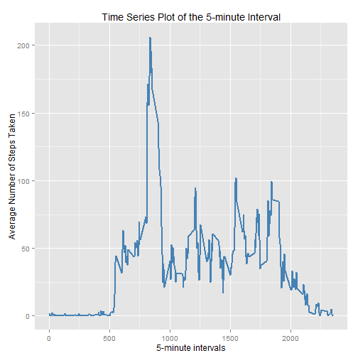

### Set echo to true

```r
echo = TRUE  # Always make code visible

### Loading and preprocessing the data
```

```r
activity <- read.csv("activity.csv", colClasses = c("integer", "Date", "factor"))
activity$month <- as.numeric(format(activity$date, "%m"))
removeNA <- na.omit(activity)
rownames(removeNA) <- 1:nrow(removeNA)
library(ggplot2)
```
### What is mean total number of steps taken per day?
For this part of the assignment, you can ignore the missing values in the dataset.

* Make a histogram of the total number of steps taken each day
ggplot(removeNA, aes(date, steps)) + geom_bar(stat = "identity", colour = "steelblue", fill = "steelblue", width = 0.7) + facet_grid(. ~ month, scales = "free") + labs(title = "Histogram of Total Number of Steps Taken Each Day", x = "Date", y = "Total number of steps")
```

* Calculate and report the mean and median total number of steps taken per day

Mean total number of steps taken per day:
        
        ```r
        totalSteps <- aggregate(removeNA$steps, list(Date = removeNA$date), FUN = "sum")$x
        mean(totalSteps)
        ```
        
        ```
        ## [1] 10766.19
        ```
Median total number of steps taken per day:
        
        ```r
        median(totalSteps)
        ```
        
        ```
        ## [1] 10765
        ```

### What is the average daily activity pattern?
* Make a time series plot (i.e. type = "l") of the 5-minute interval (x-axis) and the average number of steps taken, averaged across all days (y-axis)


```r
avgSteps <- aggregate(removeNA$steps, list(interval = as.numeric(as.character(removeNA$interval))), FUN = "mean")
names(avgSteps)[2] <- "meanOfSteps"

ggplot(avgSteps, aes(interval, meanOfSteps)) + geom_line(color = "steelblue", size = 0.8) + labs(title = "Time Series Plot of the 5-minute Interval", x = "5-minute intervals", y = "Average Number of Steps Taken")
```

 

* Which 5-minute interval, on average across all the days in the dataset, contains the maximum number of steps?

```r
avgSteps[avgSteps$meanOfSteps == max(avgSteps$meanOfSteps), ]
```

```
##     interval meanOfSteps
## 104      835    206.1698
```

### Imputing missing values
* The total number of rows with NAs:
        
        
        ```r
        sum(is.na(activity))
        ```
        
        ```
        ## [1] 2304
        ```

* Devise a strategy for filling in all of the missing values in the dataset. The strategy does not need to be sophisticated. For example, you could use the mean/median for that day, or the mean for that 5-minute interval, etc.

I used the strategy of imputing the NA value with that of 5-minute interval.

* Create a new dataset that is equal to the original dataset but with the missing data filled in.


```r
imputeddata <- activity 
for (i in 1:nrow(imputeddata)) {
        if (is.na(imputeddata$steps[i])) {
                imputeddata$steps[i] <- avgSteps[which(imputeddata$interval[i] == avgSteps$interval), ]$meanOfSteps
        }
}
```

* Make a histogram of the total number of steps taken each day and Calculate and report the mean and median total number of steps taken per day. 


```r
ggplot(imputeddata, aes(date, steps)) + geom_bar(stat = "identity",
                                             colour = "steelblue",
                                             fill = "steelblue",
                                             width = 0.7) + facet_grid(. ~ month, scales = "free") + labs(title = "Histogram of Total Number of Steps Taken Each Day using Imputed Data", x = "Date", y = "Total number of steps")
```

 

* Do these values differ from the estimates from the first part of the assignment? What is the impact of imputing missing data on the estimates of the total daily number of steps?

Mean total number of steps taken per day:
        
        ```r
        newTotalSteps <- aggregate(imputeddata$steps, 
                           list(Date = imputeddata$date), 
                           FUN = "sum")$x
        newMean <- mean(newTotalSteps)
        newMean
        ```
        
        ```
        ## [1] 10766.19
        ```
Median total number of steps taken per day:
        
        ```r
        newMedian <- median(newTotalSteps)
        newMedian
        ```
        
        ```
        ## [1] 10766.19
        ```
Compare them with the two before imputing missing data:
        
        ```r
        oldMean <- mean(totalSteps)
        oldMedian <- median(totalSteps)
        newMean - oldMean
        ```
        
        ```
        ## [1] 0
        ```
        
        ```r
        newMedian - oldMedian
        ```
        
        ```
        ## [1] 1.188679
        ```
After imputation of data, the new mean and the old mean is the same whereas the new median is greater than that of the old median.

### Are there differences in activity patterns between weekdays and weekends?

* Create a new factor variable in the dataset with two levels -- "weekday" and "weekend" indicating whether a given date is a weekday or weekend day.


```r
imputeddata$weekdays <- factor(format(imputeddata$date, "%A"))
levels(imputeddata$weekdays)
```

```
## [1] "Friday"    "Monday"    "Saturday"  "Sunday"    "Thursday"  "Tuesday"  
## [7] "Wednesday"
```

```r
levels(imputeddata$weekdays) <- list(weekday = c("Monday", "Tuesday",
                                             "Wednesday", 
                                             "Thursday", "Friday"),
                                 weekend = c("Saturday", "Sunday"))
levels(imputeddata$weekdays)
```

```
## [1] "weekday" "weekend"
```

```r
table(imputeddata$weekdays)
```

```
## 
## weekday weekend 
##   12960    4608
```

* Make a panel plot containing a time series plot (i.e. type = "l") of the 5-minute interval (x-axis) and the average number of steps taken, averaged across all weekday days or weekend days (y-axis).


```r
avgSteps <- aggregate(imputeddata$steps, 
                      list(interval = as.numeric(as.character(imputeddata$interval)), 
                           weekdays = imputeddata$weekdays),
                      FUN = "mean")
names(avgSteps)[3] <- "meanOfSteps"
library(lattice)
xyplot(avgSteps$meanOfSteps ~ avgSteps$interval | avgSteps$weekdays, 
       layout = c(1, 2), type = "l", 
       xlab = "Interval", ylab = "Number of steps")
```

 
